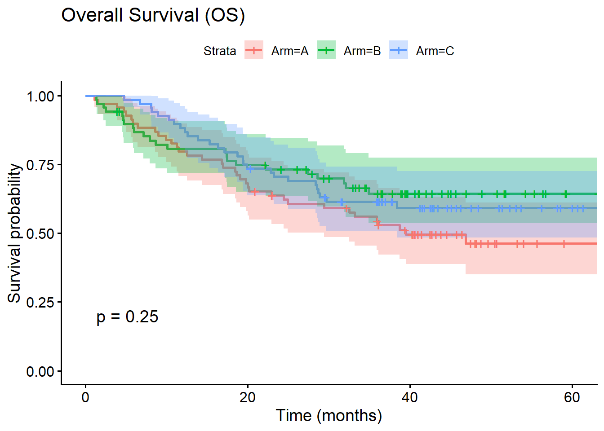
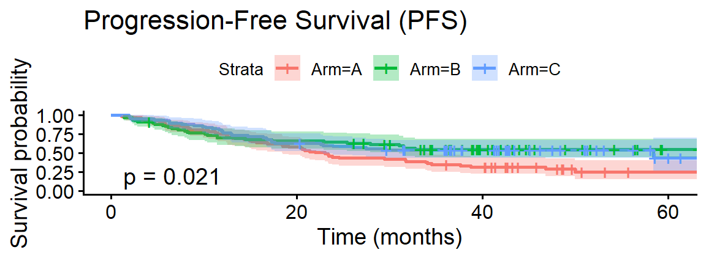
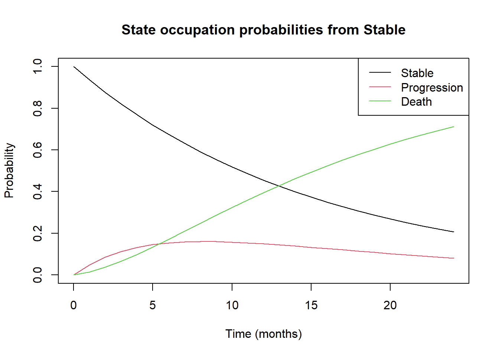
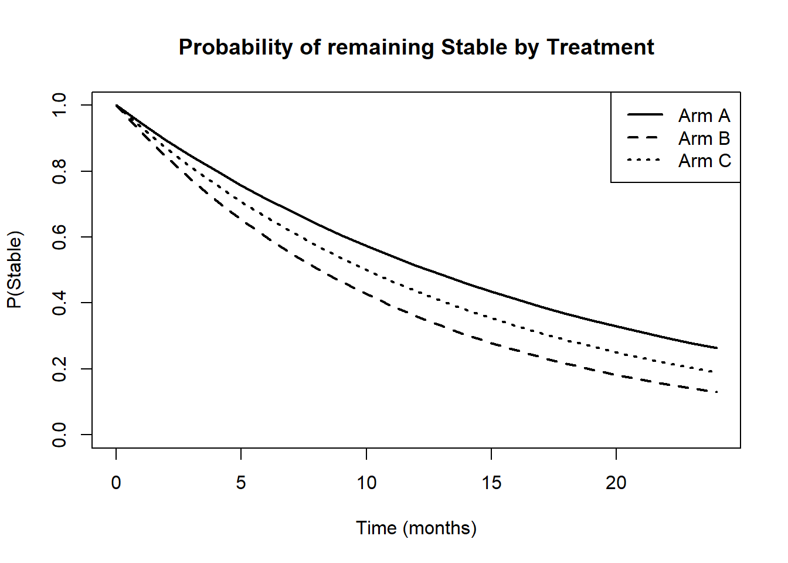
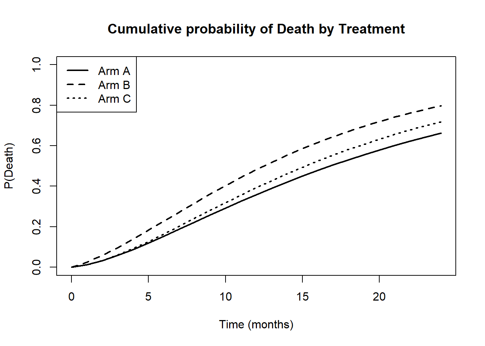

``` r
#libraries

library(dplyr)
library(ggplot2)
library(readxl)
library(survival)
library(survminer)
library(tableone)
library(mice)
library(plotly)
library(table1)
library(tidyr)
library(readr)
library(readxl)
library(dplyr)
library(table1)
library(survival)
library(survminer)
library(WinRatio) 
library(BuyseTest)
library(msm)
```


``` r
SECOMBIT <- read.csv("Secombit data.csv", check.names = FALSE)

# Clean the data to improve readability
clean_df <- SECOMBIT %>%
  mutate(
    
    # ID
    id = ordine, 
    
    # Overall Survival
    os_time   = OS,
    os_status = status,
    
    # Progression-Free Survival
    pfs_time   = `PFS TOTAL`,
    pfs_status = `Progr total`,
    
    # Treatment arm (A as baseline)
    Arm = factor(ARM, levels = c("A", "B", "C")),
    
    # Number of sites (1–2 as baseline)
    Sites = factor(sites, levels = c("1-2", ">=3"),
                   labels = c("1 - 2", ">= 3")),
    
    # LDH (Normal as baseline)
    LDH = factor(ULN_LDH, levels = c("normal", "elevated"),
                 labels = c("Normal", "Elevated")),
    
    # TMB (<10 as baseline)
    TMB = factor(TMB, levels = c("<10", ">=10"),
                 labels = c("< 10", ">= 10")),
    
    # JAK (Wild Type as baseline)
    JAK = factor(JAK, levels = c("wt", "mut"),
                 labels = c("Wild Type (Normal)", "Mutated")),
    
  ) %>%
  select(id, Arm, Sites, LDH, TMB, JAK, pfs_time, pfs_status, os_time, os_status)
```

``` r
names(clean_df)
```

```
##  [1] "id"         "Arm"        "Sites"      "LDH"        "TMB"       
##  [6] "JAK"        "pfs_time"   "pfs_status" "os_time"    "os_status"
```


``` r
# Numeric summary

numeric_summary <- SECOMBIT %>%
summarise(
mean_OS    = mean(OS, na.rm = TRUE),
sd_OS      = sd(OS, na.rm = TRUE),
median_OS  = median(OS, na.rm = TRUE),
mean_PFS   = mean(`PFS TOTAL`, na.rm = TRUE),
sd_PFS     = sd(`PFS TOTAL`, na.rm = TRUE),
median_PFS = median(`PFS TOTAL`, na.rm = TRUE)
)

numeric_summary
```

```
##    mean_OS    sd_OS median_OS mean_PFS   sd_PFS median_PFS
## 1 32.39015 17.19042      35.9 28.80602 18.06442       29.8
```


``` r
#Summary statistics for categorical variables

label(clean_df$Sites) <- "Sites"
label(clean_df$LDH)   <- "LDH"
label(clean_df$TMB)   <- "TMB"
label(clean_df$JAK)   <- "JAK"

table1(~ Sites + LDH + TMB + JAK | Arm,
       data = clean_df,
       overall = FALSE)
```

```{=html}
<div class="Rtable1"><table class="Rtable1">
<thead>
<tr>
<th class='rowlabel firstrow lastrow'></th>
<th class='firstrow lastrow'><span class='stratlabel'>A<br/><span class='stratn'>(N=69)</span></span></th>
<th class='firstrow lastrow'><span class='stratlabel'>B<br/><span class='stratn'>(N=71)</span></span></th>
<th class='firstrow lastrow'><span class='stratlabel'>C<br/><span class='stratn'>(N=69)</span></span></th>
</tr>
</thead>
<tbody>
<tr>
<td class='rowlabel firstrow'><span class='varlabel'>Sites</span></td>
<td class='firstrow'></td>
<td class='firstrow'></td>
<td class='firstrow'></td>
</tr>
<tr>
<td class='rowlabel'>1 - 2</td>
<td>43 (62.3%)</td>
<td>41 (57.7%)</td>
<td>42 (60.9%)</td>
</tr>
<tr>
<td class='rowlabel'>>= 3</td>
<td>26 (37.7%)</td>
<td>29 (40.8%)</td>
<td>26 (37.7%)</td>
</tr>
<tr>
<td class='rowlabel lastrow'>Missing</td>
<td class='lastrow'>0 (0%)</td>
<td class='lastrow'>1 (1.4%)</td>
<td class='lastrow'>1 (1.4%)</td>
</tr>
<tr>
<td class='rowlabel firstrow'><span class='varlabel'>LDH</span></td>
<td class='firstrow'></td>
<td class='firstrow'></td>
<td class='firstrow'></td>
</tr>
<tr>
<td class='rowlabel'>Normal</td>
<td>41 (59.4%)</td>
<td>41 (57.7%)</td>
<td>48 (69.6%)</td>
</tr>
<tr>
<td class='rowlabel'>Elevated</td>
<td>26 (37.7%)</td>
<td>28 (39.4%)</td>
<td>20 (29.0%)</td>
</tr>
<tr>
<td class='rowlabel lastrow'>Missing</td>
<td class='lastrow'>2 (2.9%)</td>
<td class='lastrow'>2 (2.8%)</td>
<td class='lastrow'>1 (1.4%)</td>
</tr>
<tr>
<td class='rowlabel firstrow'><span class='varlabel'>TMB</span></td>
<td class='firstrow'></td>
<td class='firstrow'></td>
<td class='firstrow'></td>
</tr>
<tr>
<td class='rowlabel'>< 10</td>
<td>20 (29.0%)</td>
<td>17 (23.9%)</td>
<td>18 (26.1%)</td>
</tr>
<tr>
<td class='rowlabel'>>= 10</td>
<td>8 (11.6%)</td>
<td>8 (11.3%)</td>
<td>12 (17.4%)</td>
</tr>
<tr>
<td class='rowlabel lastrow'>Missing</td>
<td class='lastrow'>41 (59.4%)</td>
<td class='lastrow'>46 (64.8%)</td>
<td class='lastrow'>39 (56.5%)</td>
</tr>
<tr>
<td class='rowlabel firstrow'><span class='varlabel'>JAK</span></td>
<td class='firstrow'></td>
<td class='firstrow'></td>
<td class='firstrow'></td>
</tr>
<tr>
<td class='rowlabel'>Wild Type (Normal)</td>
<td>24 (34.8%)</td>
<td>17 (23.9%)</td>
<td>16 (23.2%)</td>
</tr>
<tr>
<td class='rowlabel'>Mutated</td>
<td>5 (7.2%)</td>
<td>7 (9.9%)</td>
<td>14 (20.3%)</td>
</tr>
<tr>
<td class='rowlabel lastrow'>Missing</td>
<td class='lastrow'>40 (58.0%)</td>
<td class='lastrow'>47 (66.2%)</td>
<td class='lastrow'>39 (56.5%)</td>
</tr>
</tbody>
</table>
</div>
```

``` r
table_cat <- table1(~ LDH | Arm, data = clean_df)
table_cat
```

```{=html}
<div class="Rtable1"><table class="Rtable1">
<thead>
<tr>
<th class='rowlabel firstrow lastrow'></th>
<th class='firstrow lastrow'><span class='stratlabel'>A<br/><span class='stratn'>(N=69)</span></span></th>
<th class='firstrow lastrow'><span class='stratlabel'>B<br/><span class='stratn'>(N=71)</span></span></th>
<th class='firstrow lastrow'><span class='stratlabel'>C<br/><span class='stratn'>(N=69)</span></span></th>
<th class='firstrow lastrow'><span class='stratlabel'>Overall<br/><span class='stratn'>(N=209)</span></span></th>
</tr>
</thead>
<tbody>
<tr>
<td class='rowlabel firstrow'><span class='varlabel'>LDH</span></td>
<td class='firstrow'></td>
<td class='firstrow'></td>
<td class='firstrow'></td>
<td class='firstrow'></td>
</tr>
<tr>
<td class='rowlabel'>Normal</td>
<td>41 (59.4%)</td>
<td>41 (57.7%)</td>
<td>48 (69.6%)</td>
<td>130 (62.2%)</td>
</tr>
<tr>
<td class='rowlabel'>Elevated</td>
<td>26 (37.7%)</td>
<td>28 (39.4%)</td>
<td>20 (29.0%)</td>
<td>74 (35.4%)</td>
</tr>
<tr>
<td class='rowlabel lastrow'>Missing</td>
<td class='lastrow'>2 (2.9%)</td>
<td class='lastrow'>2 (2.8%)</td>
<td class='lastrow'>1 (1.4%)</td>
<td class='lastrow'>5 (2.4%)</td>
</tr>
</tbody>
</table>
</div>
```

``` r
mortality_plot <- ggplot(clean_df, aes(x = Arm, fill = as.factor(LDH)))+
geom_bar(position = "dodge")+
labs(
title = "LDH levels by ARM",
x = "ARM",
y = "Levels",
fill = "LDH"
) +
scale_fill_manual(values = c("pink", "black", "yellow"),
labels = c("Missing","Normal", "Elevated")) +
theme_minimal()

ggplotly(mortality_plot)
```

```{=html}
<div class="plotly html-widget html-fill-item" id="htmlwidget-a5a5bb43b569c1a75c2e" style="width:672px;height:480px;"></div>
<script type="application/json" data-for="htmlwidget-a5a5bb43b569c1a75c2e">{"x":{"data":[{"orientation":"v","width":[0.30000000000000004,0.30000000000000027,0.29999999999999982],"base":[0,0,0],"x":[0.69999999999999996,1.7,2.7000000000000002],"y":[41,41,48],"text":["count: 41<br />Arm: A<br />as.factor(LDH): Normal","count: 41<br />Arm: B<br />as.factor(LDH): Normal","count: 48<br />Arm: C<br />as.factor(LDH): Normal"],"type":"bar","textposition":"none","marker":{"autocolorscale":false,"color":"rgba(255,192,203,1)","line":{"width":1.8897637795275593,"color":"transparent"}},"name":"Normal","legendgroup":"Normal","showlegend":true,"xaxis":"x","yaxis":"y","hoverinfo":"text","frame":null},{"orientation":"v","width":[0.29999999999999993,0.29999999999999982,0.29999999999999982],"base":[0,0,0],"x":[1,2,3],"y":[26,28,20],"text":["count: 26<br />Arm: A<br />as.factor(LDH): Elevated","count: 28<br />Arm: B<br />as.factor(LDH): Elevated","count: 20<br />Arm: C<br />as.factor(LDH): Elevated"],"type":"bar","textposition":"none","marker":{"autocolorscale":false,"color":"rgba(0,0,0,1)","line":{"width":1.8897637795275593,"color":"transparent"}},"name":"Elevated","legendgroup":"Elevated","showlegend":true,"xaxis":"x","yaxis":"y","hoverinfo":"text","frame":null},{"orientation":"v","width":[0.29999999999999982,0.29999999999999982,0.29999999999999982],"base":[0,0,0],"x":[1.3,2.2999999999999998,3.2999999999999998],"y":[2,2,1],"text":["count:  2<br />Arm: A<br />as.factor(LDH): NA","count:  2<br />Arm: B<br />as.factor(LDH): NA","count:  1<br />Arm: C<br />as.factor(LDH): NA"],"type":"bar","textposition":"none","marker":{"autocolorscale":false,"color":"rgba(127,127,127,1)","line":{"width":1.8897637795275593,"color":"transparent"}},"name":"NA","legendgroup":"NA","showlegend":true,"xaxis":"x","yaxis":"y","hoverinfo":"text","frame":null}],"layout":{"margin":{"t":40.840182648401829,"r":7.3059360730593621,"b":37.260273972602747,"l":37.260273972602747},"paper_bgcolor":"rgba(255,255,255,1)","font":{"color":"rgba(0,0,0,1)","family":"","size":14.611872146118724},"title":{"text":"LDH levels by ARM","font":{"color":"rgba(0,0,0,1)","family":"","size":17.534246575342465},"x":0,"xref":"paper"},"xaxis":{"domain":[0,1],"automargin":true,"type":"linear","autorange":false,"range":[0.40000000000000002,3.6000000000000001],"tickmode":"array","ticktext":["A","B","C"],"tickvals":[1,2,3],"categoryorder":"array","categoryarray":["A","B","C"],"nticks":null,"ticks":"","tickcolor":null,"ticklen":3.6529680365296811,"tickwidth":0,"showticklabels":true,"tickfont":{"color":"rgba(77,77,77,1)","family":"","size":11.68949771689498},"tickangle":-0,"showline":false,"linecolor":null,"linewidth":0,"showgrid":true,"gridcolor":"rgba(235,235,235,1)","gridwidth":0,"zeroline":false,"anchor":"y","title":{"text":"ARM","font":{"color":"rgba(0,0,0,1)","family":"","size":14.611872146118724}},"hoverformat":".2f"},"yaxis":{"domain":[0,1],"automargin":true,"type":"linear","autorange":false,"range":[-2.4000000000000004,50.399999999999999],"tickmode":"array","ticktext":["0","10","20","30","40","50"],"tickvals":[0,10,20,30,40,50],"categoryorder":"array","categoryarray":["0","10","20","30","40","50"],"nticks":null,"ticks":"","tickcolor":null,"ticklen":3.6529680365296811,"tickwidth":0,"showticklabels":true,"tickfont":{"color":"rgba(77,77,77,1)","family":"","size":11.68949771689498},"tickangle":-0,"showline":false,"linecolor":null,"linewidth":0,"showgrid":true,"gridcolor":"rgba(235,235,235,1)","gridwidth":0,"zeroline":false,"anchor":"x","title":{"text":"Levels","font":{"color":"rgba(0,0,0,1)","family":"","size":14.611872146118724}},"hoverformat":".2f"},"shapes":[{"type":"rect","fillcolor":null,"line":{"color":null,"width":0,"linetype":[]},"yref":"paper","xref":"paper","layer":"below","x0":0,"x1":1,"y0":0,"y1":1}],"showlegend":true,"legend":{"bgcolor":null,"bordercolor":null,"borderwidth":0,"font":{"color":"rgba(0,0,0,1)","family":"","size":11.68949771689498},"title":{"text":"LDH","font":{"color":"rgba(0,0,0,1)","family":"","size":14.611872146118724}}},"hovermode":"closest","barmode":"relative"},"config":{"doubleClick":"reset","modeBarButtonsToAdd":["hoverclosest","hovercompare"],"showSendToCloud":false},"source":"A","attrs":{"60fc5b67647":{"x":{},"fill":{},"type":"bar"}},"cur_data":"60fc5b67647","visdat":{"60fc5b67647":["function (y) ","x"]},"highlight":{"on":"plotly_click","persistent":false,"dynamic":false,"selectize":false,"opacityDim":0.20000000000000001,"selected":{"opacity":1},"debounce":0},"shinyEvents":["plotly_hover","plotly_click","plotly_selected","plotly_relayout","plotly_brushed","plotly_brushing","plotly_clickannotation","plotly_doubleclick","plotly_deselect","plotly_afterplot","plotly_sunburstclick"],"base_url":"https://plot.ly"},"evals":[],"jsHooks":[]}</script>
```


``` r
#ARM-wise summary

arm_summary <- clean_df %>%
group_by(Arm) %>%
summarise(
n = n(),
mean_OS = mean(os_status, na.rm = TRUE),
sd_OS = sd(os_status, na.rm = TRUE),
mean_PFS = mean(pfs_status, na.rm = TRUE),
sd_PFS = sd(pfs_status, na.rm = TRUE),
.groups = "drop"
)

arm_summary
```

```
## # A tibble: 3 × 6
##   Arm       n mean_OS sd_OS mean_PFS sd_PFS
##   <fct> <int>   <dbl> <dbl>    <dbl>  <dbl>
## 1 A        69   0.507 0.504    0.710  0.457
## 2 B        71   0.333 0.475    0.435  0.499
## 3 C        69   0.397 0.493    0.471  0.503
```

``` r
event_count <- clean_df %>%
  group_by(Arm)  %>%
  summarise(
    OS_Events = sum(os_status == 1, na.rm = TRUE),
    PFS_Events = sum(pfs_status == 1, na.rm = TRUE),
    .groups = "drop"
  )
event_count
```

```
## # A tibble: 3 × 3
##   Arm   OS_Events PFS_Events
##   <fct>     <int>      <int>
## 1 A            35         49
## 2 B            23         30
## 3 C            27         32
```

``` r
event_long <- event_count %>%
  pivot_longer(
    cols = c(OS_Events, PFS_Events),
    names_to = "Endpoint",
    values_to = "Events"
  )

plot_events <- ggplot(event_long, aes(x = Arm, y = Events, fill = Endpoint)) +
  geom_col (position = position_dodge(width = 0.7))+
  labs(
    title = "OS and PFS : Event Vs Arms",
    x = "ARM",
    y = "No. of events",
    fill = "Endpoint",
  ) +
scale_fill_manual(values = c("OS_Events"  = "red", 
                             "PFS_Events" = "blue"))+
theme_minimal()

ggplotly(plot_events)
```

```{=html}
<div class="plotly html-widget html-fill-item" id="htmlwidget-fea900e675a0fa1b5989" style="width:672px;height:480px;"></div>
<script type="application/json" data-for="htmlwidget-fea900e675a0fa1b5989">{"x":{"data":[{"orientation":"v","width":[0.44999999999999984,0.44999999999999996,0.45000000000000018],"base":[0,0,0],"x":[0.82499999999999996,1.8249999999999997,2.8250000000000002],"y":[35,23,27],"text":["Arm: A<br />Events: 35<br />Endpoint: OS_Events","Arm: B<br />Events: 23<br />Endpoint: OS_Events","Arm: C<br />Events: 27<br />Endpoint: OS_Events"],"type":"bar","textposition":"none","marker":{"autocolorscale":false,"color":"rgba(255,0,0,1)","line":{"width":1.8897637795275593,"color":"transparent"}},"name":"OS_Events","legendgroup":"OS_Events","showlegend":true,"xaxis":"x","yaxis":"y","hoverinfo":"text","frame":null},{"orientation":"v","width":[0.44999999999999984,0.45000000000000018,0.45000000000000018],"base":[0,0,0],"x":[1.175,2.1749999999999998,3.1749999999999998],"y":[49,30,32],"text":["Arm: A<br />Events: 49<br />Endpoint: PFS_Events","Arm: B<br />Events: 30<br />Endpoint: PFS_Events","Arm: C<br />Events: 32<br />Endpoint: PFS_Events"],"type":"bar","textposition":"none","marker":{"autocolorscale":false,"color":"rgba(0,0,255,1)","line":{"width":1.8897637795275593,"color":"transparent"}},"name":"PFS_Events","legendgroup":"PFS_Events","showlegend":true,"xaxis":"x","yaxis":"y","hoverinfo":"text","frame":null}],"layout":{"margin":{"t":40.840182648401829,"r":7.3059360730593621,"b":37.260273972602747,"l":37.260273972602747},"paper_bgcolor":"rgba(255,255,255,1)","font":{"color":"rgba(0,0,0,1)","family":"","size":14.611872146118724},"title":{"text":"OS and PFS : Event Vs Arms","font":{"color":"rgba(0,0,0,1)","family":"","size":17.534246575342465},"x":0,"xref":"paper"},"xaxis":{"domain":[0,1],"automargin":true,"type":"linear","autorange":false,"range":[0.40000000000000002,3.6000000000000001],"tickmode":"array","ticktext":["A","B","C"],"tickvals":[1,2,3],"categoryorder":"array","categoryarray":["A","B","C"],"nticks":null,"ticks":"","tickcolor":null,"ticklen":3.6529680365296811,"tickwidth":0,"showticklabels":true,"tickfont":{"color":"rgba(77,77,77,1)","family":"","size":11.68949771689498},"tickangle":-0,"showline":false,"linecolor":null,"linewidth":0,"showgrid":true,"gridcolor":"rgba(235,235,235,1)","gridwidth":0,"zeroline":false,"anchor":"y","title":{"text":"ARM","font":{"color":"rgba(0,0,0,1)","family":"","size":14.611872146118724}},"hoverformat":".2f"},"yaxis":{"domain":[0,1],"automargin":true,"type":"linear","autorange":false,"range":[-2.4500000000000002,51.450000000000003],"tickmode":"array","ticktext":["0","10","20","30","40","50"],"tickvals":[0,10,20,30.000000000000004,40,50],"categoryorder":"array","categoryarray":["0","10","20","30","40","50"],"nticks":null,"ticks":"","tickcolor":null,"ticklen":3.6529680365296811,"tickwidth":0,"showticklabels":true,"tickfont":{"color":"rgba(77,77,77,1)","family":"","size":11.68949771689498},"tickangle":-0,"showline":false,"linecolor":null,"linewidth":0,"showgrid":true,"gridcolor":"rgba(235,235,235,1)","gridwidth":0,"zeroline":false,"anchor":"x","title":{"text":"No. of events","font":{"color":"rgba(0,0,0,1)","family":"","size":14.611872146118724}},"hoverformat":".2f"},"shapes":[{"type":"rect","fillcolor":null,"line":{"color":null,"width":0,"linetype":[]},"yref":"paper","xref":"paper","layer":"below","x0":0,"x1":1,"y0":0,"y1":1}],"showlegend":true,"legend":{"bgcolor":null,"bordercolor":null,"borderwidth":0,"font":{"color":"rgba(0,0,0,1)","family":"","size":11.68949771689498},"title":{"text":"Endpoint","font":{"color":"rgba(0,0,0,1)","family":"","size":14.611872146118724}}},"hovermode":"closest","barmode":"relative"},"config":{"doubleClick":"reset","modeBarButtonsToAdd":["hoverclosest","hovercompare"],"showSendToCloud":false},"source":"A","attrs":{"60fc70cd7ee0":{"x":{},"y":{},"fill":{},"type":"bar"}},"cur_data":"60fc70cd7ee0","visdat":{"60fc70cd7ee0":["function (y) ","x"]},"highlight":{"on":"plotly_click","persistent":false,"dynamic":false,"selectize":false,"opacityDim":0.20000000000000001,"selected":{"opacity":1},"debounce":0},"shinyEvents":["plotly_hover","plotly_click","plotly_selected","plotly_relayout","plotly_brushed","plotly_brushing","plotly_clickannotation","plotly_doubleclick","plotly_deselect","plotly_afterplot","plotly_sunburstclick"],"base_url":"https://plot.ly"},"evals":[],"jsHooks":[]}</script>
```

``` r
#Baseline variables

vars <- c("Sites", "LDH", "TMB", "JAK", "os_status", "pfs_status")
factorVars <- c("Sites", "LDH", "TMB", "JAK")

tab1 <- CreateTableOne(
vars = vars,
strata = "Arm",
data = clean_df,
factorVars = factorVars
)

print(tab1, showAllLevels = TRUE, quote = FALSE, noSpaces = TRUE)
```

```
##                         Stratified by Arm
##                          level              A           B           C          
##   n                                         69          71          69         
##   Sites (%)              1 - 2              43 (62.3)   41 (58.6)   42 (61.8)  
##                          >= 3               26 (37.7)   29 (41.4)   26 (38.2)  
##   LDH (%)                Normal             41 (61.2)   41 (59.4)   48 (70.6)  
##                          Elevated           26 (38.8)   28 (40.6)   20 (29.4)  
##   TMB (%)                < 10               20 (71.4)   17 (68.0)   18 (60.0)  
##                          >= 10              8 (28.6)    8 (32.0)    12 (40.0)  
##   JAK (%)                Wild Type (Normal) 24 (82.8)   17 (70.8)   16 (53.3)  
##                          Mutated            5 (17.2)    7 (29.2)    14 (46.7)  
##   os_status (mean (SD))                     0.51 (0.50) 0.33 (0.47) 0.40 (0.49)
##   pfs_status (mean (SD))                    0.71 (0.46) 0.43 (0.50) 0.47 (0.50)
##                         Stratified by Arm
##                          p     test
##   n                                
##   Sites (%)              0.887     
##                                    
##   LDH (%)                0.346     
##                                    
##   TMB (%)                0.639     
##                                    
##   JAK (%)                0.050     
##                                    
##   os_status (mean (SD))  0.111     
##   pfs_status (mean (SD)) 0.002
```


``` r
par(mar = c(3, 3, 1.1, 1))
fit_os <- survfit(Surv(os_time, os_status) ~ Arm, data = clean_df)

ggsurvplot(
  fit_os, data = clean_df,
  xlab = "Time (months)", ylab = "Survival probability",
  title = "Overall Survival (OS)",
  risk.table = FALSE, pval = TRUE, conf.int = TRUE
)
```

```
## Warning: Using `size` aesthetic for lines was deprecated in ggplot2 3.4.0.
## ℹ Please use `linewidth` instead.
## ℹ The deprecated feature was likely used in the ggpubr package.
##   Please report the issue at <https://github.com/kassambara/ggpubr/issues>.
## This warning is displayed once every 8 hours.
## Call `lifecycle::last_lifecycle_warnings()` to see where this warning was
## generated.
```





``` r
#LogRank test

logrank_os  <- survdiff(Surv(os_time, os_status) ~ Arm, data = clean_df)
logrank_pfs <- survdiff(Surv(pfs_time, pfs_status) ~ Arm, data = clean_df)

p_os  <- 1 - pchisq(logrank_os$chisq,  df = length(logrank_os$n)  - 1)
p_pfs <- 1 - pchisq(logrank_pfs$chisq, df = length(logrank_pfs$n) - 1)

logrank_tab <- data.frame(
  Endpoint = c("OS", "PFS"),
  `Chi-square` = round(c(logrank_os$chisq, logrank_pfs$chisq), 2),
  df = c(length(logrank_os$n)-1, length(logrank_pfs$n)-1),
  `p-value` = signif(c(p_os, p_pfs), 3)
)

knitr::kable(logrank_tab, format = "html", align = "lccc") |>
  kableExtra::kable_styling(full_width = TRUE, font_size = 16)
```

<table class="table" style="font-size: 16px; margin-left: auto; margin-right: auto;">
 <thead>
  <tr>
   <th style="text-align:left;"> Endpoint </th>
   <th style="text-align:center;"> Chi.square </th>
   <th style="text-align:center;"> df </th>
   <th style="text-align:center;"> p.value </th>
  </tr>
 </thead>
<tbody>
  <tr>
   <td style="text-align:left;"> OS </td>
   <td style="text-align:center;"> 2.80 </td>
   <td style="text-align:center;"> 2 </td>
   <td style="text-align:center;"> 0.2460 </td>
  </tr>
  <tr>
   <td style="text-align:left;"> PFS </td>
   <td style="text-align:center;"> 7.74 </td>
   <td style="text-align:center;"> 2 </td>
   <td style="text-align:center;"> 0.0208 </td>
  </tr>
</tbody>
</table>

**Inference - Survival curves and Cox Log-Rank tests**

Survival curves and log‑rank tests
The Kaplan–Meier curves for OS appear relatively close, and the log‑rank test p‑value around 0.25 suggests no statistically significant difference in overall survival across arms at this stage.

The PFS curves separate more clearly, with a log‑rank p‑value near 0.02, indicating evidence that at least one arm differs in progression‑free survival, consistent with SECOMBIT reports that sequencing can affect progression endpoints.

``` r
#Cox proportional Hazards model


library(broom)

cox_os  <- coxph(Surv(os_time, os_status) ~ Arm + Sites + LDH + TMB + JAK,
                 data = clean_df, ties = "efron")
cox_pfs <- coxph(Surv(pfs_time, pfs_status) ~ Arm + Sites + LDH + TMB + JAK,
                 data = clean_df, ties = "efron")

tidy_cox <- function(fit, title){
  broom::tidy(fit, exponentiate = TRUE, conf.int = TRUE) |>
    mutate(
      HR_CI = sprintf("%.2f (%.2f–%.2f)", estimate, conf.low, conf.high),
      p = signif(p.value, 3)
    ) |>
    select(term, HR_CI, p) |>
    rename(Variable = term, `HR (95% CI)` = HR_CI, `p-value` = p) |>
    (\(df){
      cat(paste0("<b>", title, "</b>"))
      knitr::kable(df, format="html", escape=TRUE) |>
        kableExtra::kable_styling(full_width=TRUE, font_size=18)
    })()
}

tidy_cox(cox_os,  "Cox model — Overall Survival (OS)")
```

```
## <b>Cox model — Overall Survival (OS)</b>
```

<table class="table" style="font-size: 18px; margin-left: auto; margin-right: auto;">
 <thead>
  <tr>
   <th style="text-align:left;"> Variable </th>
   <th style="text-align:left;"> HR (95% CI) </th>
   <th style="text-align:right;"> p-value </th>
  </tr>
 </thead>
<tbody>
  <tr>
   <td style="text-align:left;"> ArmB </td>
   <td style="text-align:left;"> 0.98 (0.38–2.50) </td>
   <td style="text-align:right;"> 0.9590 </td>
  </tr>
  <tr>
   <td style="text-align:left;"> ArmC </td>
   <td style="text-align:left;"> 0.83 (0.33–2.07) </td>
   <td style="text-align:right;"> 0.6900 </td>
  </tr>
  <tr>
   <td style="text-align:left;"> Sites&gt;= 3 </td>
   <td style="text-align:left;"> 2.02 (0.93–4.42) </td>
   <td style="text-align:right;"> 0.0764 </td>
  </tr>
  <tr>
   <td style="text-align:left;"> LDHElevated </td>
   <td style="text-align:left;"> 0.96 (0.43–2.15) </td>
   <td style="text-align:right;"> 0.9130 </td>
  </tr>
  <tr>
   <td style="text-align:left;"> TMB&gt;= 10 </td>
   <td style="text-align:left;"> 0.72 (0.31–1.67) </td>
   <td style="text-align:right;"> 0.4480 </td>
  </tr>
  <tr>
   <td style="text-align:left;"> JAKMutated </td>
   <td style="text-align:left;"> 0.63 (0.24–1.63) </td>
   <td style="text-align:right;"> 0.3380 </td>
  </tr>
</tbody>
</table>

``` r
cat("<br>")
```

```
## <br>
```

``` r
tidy_cox(cox_pfs, "Cox model — Progression-Free Survival (PFS)")
```

```
## <b>Cox model — Progression-Free Survival (PFS)</b>
```

<table class="table" style="font-size: 18px; margin-left: auto; margin-right: auto;">
 <thead>
  <tr>
   <th style="text-align:left;"> Variable </th>
   <th style="text-align:left;"> HR (95% CI) </th>
   <th style="text-align:right;"> p-value </th>
  </tr>
 </thead>
<tbody>
  <tr>
   <td style="text-align:left;"> ArmB </td>
   <td style="text-align:left;"> 0.73 (0.30–1.77) </td>
   <td style="text-align:right;"> 0.4870 </td>
  </tr>
  <tr>
   <td style="text-align:left;"> ArmC </td>
   <td style="text-align:left;"> 1.03 (0.48–2.22) </td>
   <td style="text-align:right;"> 0.9470 </td>
  </tr>
  <tr>
   <td style="text-align:left;"> Sites&gt;= 3 </td>
   <td style="text-align:left;"> 1.60 (0.80–3.20) </td>
   <td style="text-align:right;"> 0.1870 </td>
  </tr>
  <tr>
   <td style="text-align:left;"> LDHElevated </td>
   <td style="text-align:left;"> 1.14 (0.56–2.34) </td>
   <td style="text-align:right;"> 0.7150 </td>
  </tr>
  <tr>
   <td style="text-align:left;"> TMB&gt;= 10 </td>
   <td style="text-align:left;"> 0.85 (0.40–1.78) </td>
   <td style="text-align:right;"> 0.6660 </td>
  </tr>
  <tr>
   <td style="text-align:left;"> JAKMutated </td>
   <td style="text-align:left;"> 0.41 (0.16–1.03) </td>
   <td style="text-align:right;"> 0.0571 </td>
  </tr>
</tbody>
</table>
The multivariable Cox proportional hazards model showed no statistically significant associations between the examined covariates and survival outcome (both OS and PFS). All variables had hazard ratios with 95% confidence intervals that included 1.0 and p-values exceeding 0.05.

#COX Model for OS

In the Cox model for OS, the hazard ratios for Arm B and Arm C versus Arm A are close to 1 with wide confidence intervals and non‑significant p‑values, suggesting no clear survival advantage yet for any single sequencing strategy.

Some baseline factors, such as number of metastatic sites and LDH elevation, typically show increased mortality risk in melanoma trials, so if their HRs are above 1 with low p‑values, this aligns with prior evidence that greater tumour burden and elevated LDH are adverse prognostic markers.

#COX Model for PFS

The Cox model results for progression‑free survival show no statistically significant effects for treatment arms or most covariates, though JAK mutation and Arm B trends toward better outcomes.

JAK mutated has the strongest signal with HR 0.41 (95% CI: 0.16–1.03, p=0.057), nearly halving progression risk and just missing significance; this matches SECOMBIT biomarker findings where JAK‑mutated patients had unexpectedly good PFS and brain metastasis‑free survival.

Sites ≥3 (HR 1.60, 95% CI: 0.80–3.20, p=0.187) and elevated LDH (HR 1.14, 95% CI: 0.56–2.34, p=0.715) show increased risk trends, reflecting tumour burden as an adverse factor, though wide CIs suggest limited power.

TMB ≥10 has HR 0.85 (95% CI: 0.40–1.78, p=0.666), a neutral protective trend, in line with high TMB benefiting immunotherapy‑containing arms.

Covariates such as elevated LDH, high TMB, or multiple sites, when associated with HRs above 1, reflect faster progression, again consistent with external evidence that high tumour burden and certain biomarker profiles predict shorter progression‑free survival.

### PH Test

<table class="table" style="font-size: 18px; margin-left: auto; margin-right: auto;">
 <thead>
  <tr>
   <th style="text-align:left;"> Endpoint </th>
   <th style="text-align:right;"> PH.test.p.value </th>
  </tr>
 </thead>
<tbody>
  <tr>
   <td style="text-align:left;"> OS </td>
   <td style="text-align:right;"> 0.0581 </td>
  </tr>
  <tr>
   <td style="text-align:left;"> PFS </td>
   <td style="text-align:right;"> 0.0119 </td>
  </tr>
</tbody>
</table>
**Summary**

The PH test p-values indicate moderate violations of the proportional hazards assumption in the OS model and a more serious violation in the PFS model.

**OS model (p = 0.0581)**
This borderline p-value suggests the proportional hazards assumption holds approximately for overall survival, but there's weak evidence against it.

Hazard ratios from the Cox model remain reasonably interpretable, though caution is warranted; the curves may cross or diverge over time.
​

** PFS model (p = 0.0119)**

The low p-value clearly rejects proportional hazards for progression-free survival, meaning treatment effects likely change over follow-up time.

This justifies moving beyond standard Cox to time-varying effects, stratified models, or multi-state approaches.

#Win-ratio 
## B Vs A

``` r
wr_ba <- winratio(id = "id",
                  trt = "Arm",
                  outcomes = list(
                    outc1 = c("os_status", "s", "os_time"),
                    outc2 = c("pfs_status", "s", "pfs_time")
                  ),
                  fu = "os_time",
                  data = clean_df %>% filter(Arm != "C") %>%
                    filter(!is.na(pfs_time)| !is.na(os_time)) %>%
                    mutate(pfs_time = round(pfs_time, 1),
                           os_time = round(os_time, 1))
)
```

```
## Warning: 
## Active group = 'B'
```

``` r
summary(wr_ba)
```

```
## Number of subjects: N = 138 
## Number of subjects in group 'B': 69
## Number of subjects in group 'A': 69
## Number of paired comparison: 4761
## Active group = group 'B'
##   
## Outcome 1 = os_status, os_time (survival event)
## Outcome 2 = pfs_status, pfs_time (survival event)
## 
##           Numbers of 'winners' Numbers of 'losers'
## Outcome 1                 1733                1271
## Outcome 2                  556                 270
## Total                     2289                1541
## 
## Total number of ties: 931
## 
## Win Ratio (CI 95%) = 1.49 (0.93 - 2.38), p-value = 0.0993
## 
## Signif. codes: '***' p < 0.001, '**' p < 0.01, '*' p < 0.05.
```
* This win-ratio analysis favours ARM B over ARM A with a clincially meaningful point estimate but lacks statistical significance.

* Out of 4761 paired comparisons between Arms A and B (with 69 patients in each arm), ARM B **wins** 2289 pairs while ARM A wins 1541, with a win-ratio of 1.49 and a p-value of 0.0993.

* Wins are more driven by OS (1733 Vs 1271) than PFS (556 Vs 270). This reflects ARM B's edge in both endpoints despite individual COX models with non-significant Hazard ratios.

* This aligns with SECOMBIT's longer-term data favoring Arms B & C.


## C Vs A

``` r
wr_ca <- winratio(id = "id",
                  trt = "Arm",
                  outcomes = list(
                    outc1 = c("os_status", "s", "os_time"),
                    outc2 = c("pfs_status", "s", "pfs_time")
                  ),
                  fu = "os_time",
                  data = clean_df %>% filter(Arm != "B") %>%
                    filter(!is.na(pfs_time)| !is.na(os_time)) %>%
                    mutate(pfs_time = round(pfs_time, 1),
                           os_time = round(os_time, 1))
)
```

```
## Warning: 
## Active group = 'C'
```

``` r
summary(wr_ca)
```

```
## Number of subjects: N = 137 
## Number of subjects in group 'C': 68
## Number of subjects in group 'A': 69
## Number of paired comparison: 4692
## Active group = group 'C'
##   
## Outcome 1 = os_status, os_time (survival event)
## Outcome 2 = pfs_status, pfs_time (survival event)
## 
##           Numbers of 'winners' Numbers of 'losers'
## Outcome 1                 1849                1347
## Outcome 2                  512                 143
## Total                     2361                1490
## 
## Total number of ties: 841
## 
## Win Ratio (CI 95%) = 1.58 (1.00 - 2.51), p-value = 0.0508
## 
## Signif. codes: '***' p < 0.001, '**' p < 0.01, '*' p < 0.05.
```
The win-ratio analysis show Arm C has a statistically significant advantage over Arm A, with a superior OS performance.

* Out of 4692 paired comparisons between Arms C and A (with 68 patients in Arm C and 69 in Arm A), ARM C wins 2361 pairs while ARM A wins only 143, with a win-ratio of 1.58 and p-value is at 0.0508.

* Strong OS contribution dominates with PFS also favouring ARM C. 

* Few ties than other analyses sharpen the signal.

* Both Arm C and A show no benefit over control, with Arm C has nominal significance despite similar sample sizes.

## C Vs B

``` r
wr_cb <- winratio(id = "id",
                  trt = "Arm",
                  outcomes = list(
                    outc1 = c("os_status", "s", "os_time"),
                    outc2 = c("pfs_status", "s", "pfs_time")
                  ),
                  fu = "os_time",
                  data = clean_df %>% filter(Arm != "A") %>%
                    filter(!is.na(pfs_time)| !is.na(os_time)) %>%
                    mutate(pfs_time = round(pfs_time, 1),
                           os_time = round(os_time, 1))
)
```

```
## Warning: 
## Active group = 'C'
```

``` r
summary(wr_cb)
```

```
## Number of subjects: N = 137 
## Number of subjects in group 'C': 68
## Number of subjects in group 'B': 69
## Number of paired comparison: 4692
## Active group = group 'C'
##   
## Outcome 1 = os_status, os_time (survival event)
## Outcome 2 = pfs_status, pfs_time (survival event)
## 
##           Numbers of 'winners' Numbers of 'losers'
## Outcome 1                 1334                1353
## Outcome 2                  312                 209
## Total                     1646                1562
## 
## Total number of ties: 1484
## 
## Win Ratio (CI 95%) = 1.05 (0.63 - 1.76), p-value = 0.8410
## 
## Signif. codes: '***' p < 0.001, '**' p < 0.01, '*' p < 0.05.
```
* The win-ratio analysis show no meaningful advantage for Arm C over Arm B, with a near-neutral point estimate and no statistical significance.

* Out of 4692 paired comparisons between Arms C and B (with 68 patients in Arm C and 69 in Arm B), ARM C wins 1646 pairs while ARM B wins 1562, with a win-ratio of 1.05 and p-value is at 0.8410.

* OS wins are balanced and PFS slightly favours ARM C. 

* High ties and similar totals indicates equivalence.

* Both Arm B and C outperform A without any clear superiority between them.


``` r
#Adjusted p-values for multiple testing

pvals <- c(
  "B_vs_A" = wr_ba$p.value,
  "C_vs_B" = wr_cb$p.value,
  "C_vs_A" = wr_ca$p.value
)

p.adjust(pvals, method = "bonferroni")
```

```
##    B_vs_A    C_vs_B    C_vs_A 
## 0.2978733 1.0000000 0.1524661
```
After multiple testing adjustment using Bonferroni, none of the win-ratio comparisions between arms shows statistical significance.

* **B Vs A:** Original p=0.099 becomes 0.298 (non-significant)

* **C Vs B:** Original p=0.841 becomes 1.000 (non-significant)

* **C Vs A:** Original p=0.051 becomes 0.1525 (non-significant)

* Bonferroni correction for 3 comparisons appropriately controls arm-wise error but reduces power with approximately 68-69 patients in each arm

* Unadjusted trends - Arm B and C both favor over Arm A but lacks confirmation.


``` r
# **NET BENEFIT**
# B Vs A

nb_df_BA <- clean_df %>%
  filter(Arm %in% c("A","B")) %>%
  filter(!is.na(os_time) | !is.na(pfs_time)) %>%   # keep if at least one endpoint present
  mutate(
    trt = factor(Arm, levels = c("A","B"))
  )

nb_BA <- BuyseTest(
  trt ~ 
    tte(os_time, os_status, threshold = 0) +   # priority 1: OS
    tte(pfs_time, pfs_status, threshold = 0),  # priority 2: PFS
  data = nb_df_BA,
  hierarchical = TRUE
)
```

```
## 
##          Generalized Pairwise Comparisons
## 
## Settings 
##    - 2 groups   : Control = A and Treatment = B
##    - 2 endpoints: 
##        priority endpoint  type           operator             event           
##        1        os_time   time to event  higher is favorable  os_status (0 1) 
##        2        pfs_time  time to event  higher is favorable  pfs_status (0 1)
##    - neutral pairs: re-analyzed using lower priority endpoints 
##    - right-censored pairs: probabilistic score based on the survival curves 
## 
## Point estimation and calculation of the iid decomposition
## 
## Estimation of the estimator's distribution 
##    - method: moments of the U-statistic
## 
## Gather the results in a S4BuyseTest object
```

``` r
summary(nb_BA)
```

```
##        Generalized pairwise comparisons with 2 prioritized endpoints
## 
##  - statistic       : net treatment benefit  (delta: endpoint specific, Delta: global) 
##  - null hypothesis : Delta == 0 
##  - confidence level: 0.95 
##  - inference       : H-projection of order 1 after atanh transformation 
##  - treatment groups: B (treatment) vs. A (control) 
##  - censored pairs  : probabilistic score based on the survival curves
##  - neutral pairs   : re-analyzed using lower priority endpoints
##  - uninformative pairs: no contribution at the current endpoint, analyzed at later endpoints
##  - results
##  endpoint total(%) favorable(%) unfavorable(%) neutral(%) uninf(%)  delta
##   os_time   100.00        41.76          28.42       0.02    29.80 0.1334
##  pfs_time    29.82        12.68           4.02       0.00    13.11 0.0866
##   Delta CI [2.5% ; 97.5%]  p.value  
##  0.1334  [-0.0501;0.3082] 0.153596  
##  0.2200   [0.0204;0.4028] 0.030999 *
```
* Significant PFS contribution (p-value 0.031)

* Global results reflects 22% net benefit for B with OS alone contributing for 13% with 8.6% from PFS. 


``` r
# C Vs A
nb_df_CA <- clean_df %>%
  filter(Arm %in% c("A","C")) %>%
  filter(!is.na(os_time) | !is.na(pfs_time)) %>%
  mutate(trt = factor(Arm, levels = c("A","C")))   # A control, C treatment

nb_CA <- BuyseTest(
  trt ~ 
    tte(os_time, os_status, threshold = 0) +
    tte(pfs_time, pfs_status, threshold = 0),
  data = nb_df_CA,
  hierarchical = TRUE
)
```

```
## 
##          Generalized Pairwise Comparisons
## 
## Settings 
##    - 2 groups   : Control = A and Treatment = C
##    - 2 endpoints: 
##        priority endpoint  type           operator             event           
##        1        os_time   time to event  higher is favorable  os_status (0 1) 
##        2        pfs_time  time to event  higher is favorable  pfs_status (0 1)
##    - neutral pairs: re-analyzed using lower priority endpoints 
##    - right-censored pairs: probabilistic score based on the survival curves 
## 
## Point estimation and calculation of the iid decomposition
## 
## Estimation of the estimator's distribution 
##    - method: moments of the U-statistic
## 
## Gather the results in a S4BuyseTest object
```

``` r
summary(nb_CA)
```

```
##        Generalized pairwise comparisons with 2 prioritized endpoints
## 
##  - statistic       : net treatment benefit  (delta: endpoint specific, Delta: global) 
##  - null hypothesis : Delta == 0 
##  - confidence level: 0.95 
##  - inference       : H-projection of order 1 after atanh transformation 
##  - treatment groups: C (treatment) vs. A (control) 
##  - censored pairs  : probabilistic score based on the survival curves
##  - uninformative pairs: no contribution at the current endpoint, analyzed at later endpoints
##  - results
##  endpoint total(%) favorable(%) unfavorable(%) neutral(%) uninf(%)  delta
##   os_time    100.0        42.92          29.68          0    27.40 0.1323
##  pfs_time     27.4        12.01           5.10          0    10.29 0.0691
##   Delta CI [2.5% ; 97.5%]  p.value  
##  0.1323  [-0.0501;0.3062] 0.154446  
##  0.2015    [1e-04;0.3871] 0.049903 *
```
* Generalised pairwise comparisons for Arm C vs Arm A is similar to Arm B Vs Arm A.

* Global net benefit :  0.2015 - Arm C beats Arm A by overall 20.15% with 13.23% contributed by the OS. 

* Strong PFS signal noted (p=0.0499)


``` r
# C Vs B

nb_df_CB <- clean_df %>%
  filter(Arm %in% c("B","C")) %>%
  filter(!is.na(os_time) | !is.na(pfs_time)) %>%
  mutate(trt = factor(Arm, levels = c("B","C")))   # B control, C treatment

nb_CB <- BuyseTest(
  trt ~ 
    tte(os_time, os_status, threshold = 0) +
    tte(pfs_time, pfs_status, threshold = 0),
  data = nb_df_CB,
  hierarchical = TRUE
)
```

```
## 
##          Generalized Pairwise Comparisons
## 
## Settings 
##    - 2 groups   : Control = B and Treatment = C
##    - 2 endpoints: 
##        priority endpoint  type           operator             event           
##        1        os_time   time to event  higher is favorable  os_status (0 1) 
##        2        pfs_time  time to event  higher is favorable  pfs_status (0 1)
##    - neutral pairs: re-analyzed using lower priority endpoints 
##    - right-censored pairs: probabilistic score based on the survival curves 
## 
## Point estimation and calculation of the iid decomposition
## 
## Estimation of the estimator's distribution 
##    - method: moments of the U-statistic
## 
## Gather the results in a S4BuyseTest object
```

``` r
summary(nb_CB)
```

```
##        Generalized pairwise comparisons with 2 prioritized endpoints
## 
##  - statistic       : net treatment benefit  (delta: endpoint specific, Delta: global) 
##  - null hypothesis : Delta == 0 
##  - confidence level: 0.95 
##  - inference       : H-projection of order 1 after atanh transformation 
##  - treatment groups: C (treatment) vs. B (control) 
##  - censored pairs  : probabilistic score based on the survival curves
##  - uninformative pairs: no contribution at the current endpoint, analyzed at later endpoints
##  - results
##  endpoint total(%) favorable(%) unfavorable(%) neutral(%) uninf(%)   delta
##   os_time   100.00        30.41          31.41          0    38.18 -0.0101
##  pfs_time    38.18         5.57           9.46          0    23.16 -0.0389
##    Delta CI [2.5% ; 97.5%] p.value 
##  -0.0101  [-0.1817;0.1621] 0.90947 
##  -0.0490  [-0.2478;0.1537] 0.63738
```
* Generalised pairwise comparisons confirm equivalence between Arms C and B with no net benefit.

* OS contribution -1% net confirming long term survival, PFS -3.89% is clinically not significant.


**Multi-state model**

State 1: Stable
State 2: Progression
State 3: Death


``` r
states <- c("Stable", "Progression", "Death")
```


``` r
#Define transition intensity matrix (Q)

Q <- matrix(0, nrow = 3, ncol = 3, dimnames = list(states, states))

Q["Stable","Progression"] <- 0.1
Q["Stable","Death"]       <- 0.05
Q["Progression","Death"]  <- 0.1

# Other transitions remain 0 (impossible)
```


``` r
# Prepare data in msm long format

msm_df <- clean_df %>%
  select(id, Arm, os_time, os_status, pfs_time, pfs_status) %>%
  rowwise() %>%
  do({
    id <- .$id
    arm <- .$Arm
    
    # Start in Stable at time 0
    df_list <- list(
      data.frame(id = id, time = 0, state = 1, Arm = arm)
    )
    
    # Progression, only if before death
    if(!is.na(.$pfs_time) && .$pfs_status == 1 && 
       (is.na(.$os_time) || .$pfs_time < .$os_time)){
      df_list <- c(df_list, list(data.frame(id = id, time = .$pfs_time, state = 2, Arm = arm)))
    }
    
    # Death, if occurred
    if(!is.na(.$os_time) && .$os_status == 1){
      df_list <- c(df_list, list(data.frame(id = id, time = .$os_time, state = 3, Arm = arm)))
    }
    
    bind_rows(df_list)
  }) %>%
  ungroup() %>%
  arrange(id, time)
```


``` r
#Multi-state  model

# Arm as covariate affecting all transitions
msm_fit <- msm(
  state ~ time,
  subject = id,
  data = msm_df,
  qmatrix = Q,
  covariates = ~ Arm,
  exacttimes = TRUE
)
```

```
## Warning in msm.check.times(mf$"(time)", mf$"(subject)", mf$"(state)",
## hmodel$hidden): Subjects 1, 5, 6 and others only have one complete observation,
## which doesn't give any information
```

``` r
# Summary
summary(msm_fit)
```

```
## 
## Observed numbers of individuals occupying states at each time
## 
##       State 1 State 2 State 3 Total
## 0         108       0       0   108
## 5.84       85       6      15   106
## 11.68      58       9      34   101
## 17.52      35      16      48    99
## 23.36      22      10      63    95
## 29.2       15       7      72    94
## 35.04       5       5      79    89
## 40.88       3       1      84    88
## 46.72       3       1      84    88
## 52.56       1       0      85    86
## 58.4        0       1      85    86
## 
## Expected numbers of individuals occupying states at each time
## 
##           Stable Progression    Death Total
## 0     108.000000   0.0000000  0.00000   108
## 5.84   71.746020  16.2049585 18.04902   106
## 11.68  46.567055  15.1155733 39.31737   101
## 17.52  31.166029  11.4054493 56.42852    99
## 23.36  20.439595   7.8326606 66.72774    95
## 29.2   13.876671   5.3745812 74.74875    94
## 35.04   9.057148   3.5033346 76.43952    89
## 40.88   6.172948   2.3670861 79.45997    88
## 46.72   4.289197   1.6199208 82.09088    88
## 52.56   2.882126   1.0800757 82.03780    86
## 58.4    2.012451   0.7421353 83.24541    86
## 
## Observed prevalences of states (percentages of population at risk)
## 
##          State 1   State 2  State 3
## 0     100.000000  0.000000  0.00000
## 5.84   80.188679  5.660377 14.15094
## 11.68  57.425743  8.910891 33.66337
## 17.52  35.353535 16.161616 48.48485
## 23.36  23.157895 10.526316 66.31579
## 29.2   15.957447  7.446809 76.59574
## 35.04   5.617978  5.617978 88.76404
## 40.88   3.409091  1.136364 95.45455
## 46.72   3.409091  1.136364 95.45455
## 52.56   1.162791  0.000000 98.83721
## 58.4    0.000000  1.162791 98.83721
## 
## Expected prevalences of states (percentages of population at risk)
## 
##           Stable Progression    Death
## 0     100.000000   0.0000000  0.00000
## 5.84   67.684924  15.2876967 17.02738
## 11.68  46.105995  14.9659142 38.92809
## 17.52  31.480838  11.5206559 56.99851
## 23.36  21.515363   8.2449059 70.23973
## 29.2   14.762416   5.7176395 79.51994
## 35.04  10.176571   3.9363310 85.88710
## 40.88   7.014714   2.6898706 90.29542
## 46.72   4.874088   1.8408191 93.28509
## 52.56   3.351309   1.2559020 95.39279
## 58.4    2.340059   0.8629481 96.79699
## 
## Transition hazard ratios corresponding to covariate effects
## 
## ArmB  ( unit of 1 )
##                        HR    L    U
## Stable - Progression 1.36 0.81 2.28
## Stable - Death       2.54 0.89 7.23
## Progression - Death  0.87 0.47 1.61
## 
## Transition hazard ratios corresponding to covariate effects
## 
## ArmC  ( unit of 1 )
##                        HR    L    U
## Stable - Progression 1.32 0.81 2.13
## Stable - Death       0.83 0.21 3.20
## Progression - Death  0.87 0.51 1.51
```


``` r
# Probabilities from Stable at time t
pt <- pmatrix.msm(msm_fit, t = 12)   # e.g., 12 months
pt
```

```
##                Stable Progression     Death
## Stable      0.4547051  0.14965124 0.3956436
## Progression 0.0000000  0.08742754 0.9125725
## Death       0.0000000  0.00000000 1.0000000
```

``` r
# Example: plot transition probabilities from Stable over time
times <- seq(0, 24, by = 1)  # 0–24 months
probs <- sapply(times, function(t) pmatrix.msm(msm_fit, t = t)[1, ])
matplot(times, t(probs), type = "l", lty = 1, col = 1:3,
        xlab = "Time (months)", ylab = "Probability",
        main = "State occupation probabilities from Stable")
legend("topright", legend = states, col = 1:3, lty = 1)
```




``` r
pt_A_12 <- pmatrix.msm(msm_fit, t = 12, covariates = list(Arm = "A"))
pt_B_12 <- pmatrix.msm(msm_fit, t = 12, covariates = list(Arm = "B"))
pt_C_12 <- pmatrix.msm(msm_fit, t = 12, covariates = list(Arm = "C"))

pt_A_12
```

```
##                Stable Progression     Death
## Stable      0.5132532  0.12797452 0.3587723
## Progression 0.0000000  0.07196897 0.9280310
## Death       0.0000000  0.00000000 1.0000000
```

``` r
pt_B_12
```

```
##                Stable Progression     Death
## Stable      0.3599989   0.1577352 0.4822659
## Progression 0.0000000   0.1006713 0.8993287
## Death       0.0000000   0.0000000 1.0000000
```

``` r
pt_C_12
```

```
##                Stable Progression     Death
## Stable      0.4355921   0.1712808 0.3931271
## Progression 0.0000000   0.1001501 0.8998499
## Death       0.0000000   0.0000000 1.0000000
```


``` r
probs_A <- sapply(times, function(t)
  pmatrix.msm(msm_fit, t = t, covariates = list(Arm = "A"))[1, ])

probs_B <- sapply(times, function(t)
  pmatrix.msm(msm_fit, t = t, covariates = list(Arm = "B"))[1, ])

probs_C <- sapply(times, function(t)
  pmatrix.msm(msm_fit, t = t, covariates = list(Arm = "C"))[1, ])
```


``` r
#Plots
#Probability of remaining Stable by Treatment
plot(times, probs_A[1,], type = "l", lwd = 2,
     ylim = c(0,1),
     xlab = "Time (months)",
     ylab = "P(Stable)",
     main = "Probability of remaining Stable by Treatment")

lines(times, probs_B[1,], lwd = 2, lty = 2)
lines(times, probs_C[1,], lwd = 2, lty = 3)

legend("topright",
       legend = c("Arm A", "Arm B", "Arm C"),
       lty = c(1,2,3), lwd = 2)
```



``` r
#Cumulative probability of Death by Treatment
plot(times, probs_A[3,], type = "l", lwd = 2,
     ylim = c(0,1),
     xlab = "Time (months)",
     ylab = "P(Death)",
     main = "Cumulative probability of Death by Treatment")

lines(times, probs_B[3,], lwd = 2, lty = 2)
lines(times, probs_C[3,], lwd = 2, lty = 3)

legend("topleft",
       legend = c("Arm A", "Arm B", "Arm C"),
       lty = c(1,2,3), lwd = 2)
```




``` r
summary_df <- data.frame(
  Time = c(6, 12, 24),
  Stable_A = probs_A[1, times %in% c(6,12,24)],
  Stable_B = probs_B[1, times %in% c(6,12,24)],
  Stable_C = probs_C[1, times %in% c(6,12,24)],
  Death_A  = probs_A[3, times %in% c(6,12,24)],
  Death_B  = probs_B[3, times %in% c(6,12,24)],
  Death_C  = probs_C[3, times %in% c(6,12,24)]
)

summary_df
```

```
##   Time  Stable_A  Stable_B  Stable_C   Death_A   Death_B   Death_C
## 1    6 0.7164169 0.5999991 0.6599940 0.1536184 0.2280424 0.1645959
## 2   12 0.5132532 0.3599989 0.4355921 0.3587723 0.4822659 0.3931271
## 3   24 0.2634289 0.1295992 0.1897405 0.6616776 0.7977369 0.7184972
```
